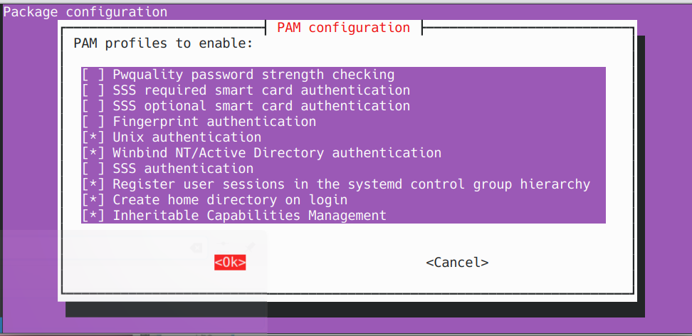

# Joining Ubuntu-Based Linux Devices to Windows Server 2025 Active Directory (Winbind Method)


Use this guide to join a Debian/Ubuntu-based Linux system (like KDE Neon, Mint or Zorin) to a Windows Server 2025 AD domain using `winbind`, `samba`, and Kerberos.

---

## 📋 Prerequisites

- Windows Server 2025 configured as Domain Controller
- Domain name 
- AD server IP
- Domain join account
- Linux client with sudo access

---

## 1. Set hostname
- Run:
  
  ```bash  
  sudo hostnamectl set-hostname <your-hostname>
  sudo nano /etc/hosts
  ```

- Replace any instance of the old hostname.

- Reboot:
  
  ```bash
  sudo reboot
  ```

---

## 2. Set dns to the ad server
- Point `/etc/resolv.conf` to your server:  
  
  ```bash  
  sudo nano /etc/resolv.conf
  ```

- Add:
  
  ```bash
  nameserver <server-IP>
  search <domain-name>
  ```

---

## 3. Install required packages
- Run:

```bash
sudo apt update
sudo apt install samba krb5-user winbind libpam-winbind libnss-winbind -y
```

- When prompted the Kerberos installer, enter your **default realm**.  
- Leave other prompts blank and press Enter.

---

## 4. Configure Kerberos
`sudo nano /etc/krb5.conf`

- Update to:

```ini
[libdefaults]
    default_realm = <domain-name>
    dns_lookup_realm = false
    dns_lookup_kdc = true
```

---

## 5. Configure Samba
- Backup and replace `/etc/samba/smb.conf`:


```bash  
sudo cp /etc/samba/smb.conf /etc/samba/smb.conf.bak
sudo nano /etc/samba/smb.conf
```  

- Paste in:

```ini
[global]
  workgroup = <workgroup>
  realm = <domain-name>
  security = ads
  client signing = yes
  client use spnego = yes
  kerberos method = secrets and keytab
  log file = /var/log/samba/%m/log
  log level = 1
  winbind refresh tickets = yes
  winbind use default domain = yes
  winbind offline logon = yes
  idmap config * : backend = tdb
  idmap config * : range = 10000-20000
  template shell = /bin/bash
  template homedir = /home/%U
```
<br>

??? tip "How to Select all in Nano Text Editor"
    
    1. Press "Alt + Backslash" keys together. This moves the cursor to the start of the file.  
    2. Press "Ctrl + 6" keys together. This sets a mark at the current cursor position.  
    3. Press "Alt + Forward Slash" keys together. This moves the cursor to the end of the file.
    4. Press "Ctrl Shift K keys together. This will clear all selected text.

---

## 6. Configure nss
`sudo nano /etc/nsswitch.conf`  
- Add `winbind` to these lines:

```ini
passwd:         compat winbind
group:          compat winbind
shadow:         compat
```

---

## 7. Restart services
```bash  
sudo systemctl restart smbd nmbd winbind
```  

- Enable on boot:

```bash  
sudo systemctl enable winbind
```

---

## 8. Test kerberos and join domain
- Test authentication: 

```bash  
kinit <domain-user>
```
!!! note "You'll most likely see a password expiration message, that's fine."

- Then join:  

```bash  
sudo net ads join -U <domain-user>
```
!!! note "Seeing DNS update failed is normal."

---

## 9. Test identity resolution
```bash
wbinfo -u     # List domain users
wbinfo -g     # List domain groups
getent passwd <domain-user>
```

---

## 10. Enable domain login and home creation
- Edit PAM and enable home dir creation:  

```bash
sudo pam-auth-update
```
> Below is what your pam settings should look like:



<br>

---

## 11. Reboot and log in
`sudo reboot`  
- Log in with domain user credentials.  
- The system will create a home folder for the user.

---

<br>

!!! success "Success! Your Linux device is now joined to the Windows Server 2025 Active Directory domain using the winbind."

<br>

---

## 🛠️ Troubleshooting & Common Issues

---

### * `kinit: Cannot find KDC for realm "<REALM>"`  
Fix:  
- Ensure `/etc/resolv.conf` points to your DC IP  
- Verify `default_realm` is UPPERCASE in `/etc/krb5.conf`  
- Test DNS:  
```bash
dig <domain-name>
```

---

### * `net ads join` **returns** `DNS update failed!`
Fix:  
Usually safe to ignore if you can log in and resolve domain names.

---

### * **Login fails after join**
Fix:  
- Ensure `winbind` is running:  
```bash
sudo systemctl status winbind
```  
- Re-run: 
```bash 
sudo pam-auth-update
```

---

### * `getent passwd <domain-user>` **returns nothing**
Fix:  
- Check `/etc/nsswitch.conf` has `winbind` on the correct lines.  
- Restart `windbind`:  
```bash
sudo systemct restart winbind
```

---

### * `winbind -u` **and** `-g` **return nothing**
Fix:  
- Validate `/etc/samba/smb.conf` and `/etc/krb5.conf` formatting.  
- Ensure realm and workgroup are correct.

<br>


