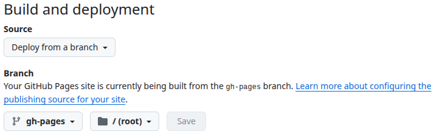

# Setting Up MkDocs with Material Theme on Linux Mint

> A step-by-step guide to creating a professional documentation site using MkDocs and GitHub Pages.

---

## 📝 Prerequisites

- [Linux Mint](https://linuxmint.com/download.php) installed 
- [GitHub](https://github.com/) account
- Terminal access
- [Visual Studio Code](https://code.visualstudio.com/download) 
- [Python](https://www.python.org/downloads/) 

## 1. Install git and github cli

* Open terminal and input:
```bash
sudo apt update   
sudo apt install git gh      
gh auth login
```

## 2. Set up a new mkdocs project

```bash
mkdocs new my-new-docs  
cd my-new-docs
```
 
## 3. Create a virtual environment

1. Open Visual Studio Code
2. Open new terminal inside Visual Studio Code
```bash
cd my-new-docs
python3 -m venv venv  
source venv/bin/activate
```

## 4. Install pip

```bash
sudo apt install python3-pip
``` 

## 5. Install mkdocs and the material theme

```bash
pip install mkdocs mkdocs-material
```

## 6. Customize your `mkdocs.yml`

* Set attributes `site_name`, theme, palette, font, favicon, and more
* Find detailed customization information [here](https://squidfunk.github.io/mkdocs-material/setup/)
* Add Markdown extension for Visual Studio Code compatibility:  

```yaml
markdown_extensions:
  - pymdownx.mark
```


## 7. Preview your site locally

`mkdocs serve`  
* View in browser at: http://127.0.0.1:8000

## 8. Push to github and deploy

```bash
git init
git remote add origin https://github.com/<your-username>/my-new-docs.git
git add .
git commit -m "Initial commit"
git push -u origin main
mkdocs gh-deploy
```

## 9. Enable github pages

1. Go to repo ⚙ Settings &rarr; Pages
2. Set branch to `gh-pages`, root folder, and save   
> Below is what your GitHub Pages settings should look like:



<br>

!!! success "Success!"
Your site should be available at:  
`https://<your-username>.github.io/my-new-docs/`

<br><br>

??? warning "Don't Forget to Deploy"

    * After updating `.md` files run `mkdocs serve` for local updates.
    * For public updates run the following: 
        ```bash  
        git add .  
        git commit -m "My update message"  
        git push  
        mkdocs gh-deploy
        ```
    * ⏱️ Note public updates can take 1-3 minutes to apply. 

---

## Additional Resources
- [MkDocs User Guide](https://www.mkdocs.org/user-guide/)
- [MkDocs Material Theme Docs](https://squidfunk.github.io/mkdocs-material/)
- [GitHub CLI Manual](https://cli.github.com/manual/)
- [Material for MkDocs: Full Tutorial To Build And Deploy Your Docs Portal](https://www.youtube.com/watch?v=xlABhbnNrfI&t=227s)