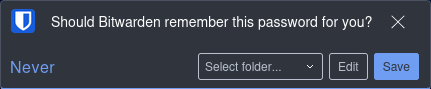

# Using the Vaultwarden Browser Extension

Vaultwarden works seamlessly with the official Bitwarden browser extension. This allows you to quickly fill in passwords, save new logins, and access your vault without opening the full web app.

---

## Step 1: Install the Browser Extension

Choose your browser and install the Bitwarden extension:

- [Chrome Web Store](https://chrome.google.com/webstore/detail/bitwarden-free-password-ma/nngceckbapebfimnlniiiahkandclblb)
- [Firefox Add-ons](https://addons.mozilla.org/en-US/firefox/addon/bitwarden-password-manager/)
- [Edge Add-ons](https://microsoftedge.microsoft.com/addons/detail/bitwarden-password-manage/jbkfoedolllekgbhcbcoahefnbanhhlh)

---

## Step 2: Log Into the Extension

1. Click the extension icon.
2. On the login screen, click **Settings**.
3. Under **Server URL**, replace the default with your self-hosted Vaultwarden address (e.g., `https://vault.bradix.org`).
4. Go back and log in with your email and master password.

!!! warning "If you don't change the Server URL, the extension will try to connect to Bitwarden's cloud servers instead of your Vaultwarden instance."

---

## Step 3: Using the Extension

Once logged in, the Bitwarden icon (a shield 🛡️) will appear near your address bar.  

Now you can:

- View and search your vault
- Autofill login forms
- Copy usernames or passwords
- Add new items on the fly

---

### Autofill a Login

1. Navigate to a website with a saved login.
2. Click the extension icon.
3. If the site is recognized, your login(s) will appear.
4. Click the one you want to autofill.

---

### Save a New Login

1. Log into a new site manually.
2. After submitting, the extension will show the below prompt:  

3. Click **Save** to save it to your vault.

!!! note "You can organize items by editing them in the web vault afterward."

---

## Locking & Unlocking the Vault

- Login &rarr; **Settings** &rarr; **Account security**
- Set a **PIN code** to unlock quickly.
- Choose to lock the vault:  
    - When the browser is closed  
    - After a timeout period  
    - Manually  

??? tip "Clear Vault Cache on Shared Devices"

    If you're using a shared or public computer, always:

    1. Log out of the extension
    2. Clear browser data (or use Incognito Mode)

 

