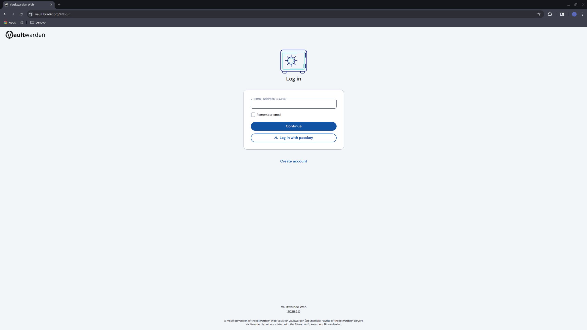

# Getting Started with Vaultwarden

Welcome! In this section, we’ll walk through how to access Vaultwarden, create your account (if needed), and log in for the first time.

---

## 📋 Requirements

Before you begin, make sure you have the following:

- An invite email or registration link (provided by your admin)
- A modern web browser (Firefox, Chrome, Edge, etc.)

---

## Step 1: Access the Web Interface

1. Open your browser.
2. Go to the Vaultwarden URL provided by your admin.
3. You should see a login screen like this:  

---

## Step 2: Create an Account

If your instance allows new user registration:

1. Click **Create Account**.
2. Fill in your email address and create a **strong master password**.
3. Click **Submit**.

!!! warning "Your master password is *not recoverable*. Choose wisely and store it in a safe place."

If your instance does not allow open registration, ask your admin for an invitation.

---

## Step 3: Log In

1. Enter your email and master password.
2. Click **Log In**.
3. You should now see your empty vault dashboard.

??? tip "First-Time Setup Tips"

    - Save your master password in a physical notebook or a separate secure place.
    - Enable 2FA as soon as possible (we'll cover this in the [User Settings](user-settings.md) section).
    - Install the [browser extension](browser-extension.md) for autofill features.

---

 

[&uarr; Back to top](#getting-started-with-vaultwarden)  

[← Back to Overview](index.md) • [→ Managing Your Vault](managing-vault.md)
